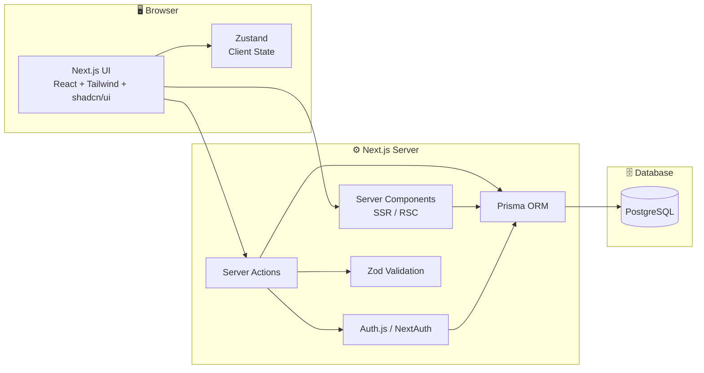
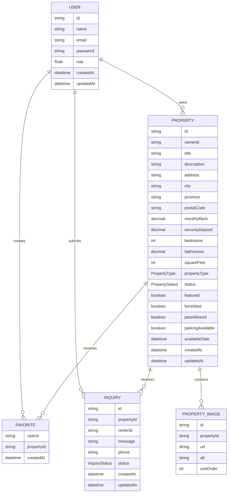

# 🏠 RentFlow — Project Overview

> **Property rental marketplace**

---

## Table of Contents

1. [Problem](#1-problem)
2. [Target Users](#2-target-users)
3. [Features](#3-features)
4. [Tech Stack](#4-tech-stack)
5. [Architecture](#5-architecture)
6. [Data Model](#6-data-model)
7. [Prisma Schema](#7-prisma-schema)
8. [Routes](#8-routes)
9. [UI / UX](#9-ui--ux)
10. [Development Rules](#10-development-rules)
11. [Open Questions](#11-open-questions)
12. [Reference Links](#12-reference-links)

---

## 1. Problem

People looking for rental properties often have to search across fragmented listing sites, contact owners through inconsistent channels, and manually keep track of properties they are interested in.

Property owners have the opposite problem: they need a simple way to publish listings, manage property information, review inquiries, and keep their available rentals organized.

**RentFlow** brings renters, property owners, and administrators into one rental platform.

The application should make it easy to:

- Browse available rental properties.
- Search and filter properties quickly.
- View detailed property information.
- Contact or submit an inquiry about a property.
- Save favorite properties.
- Create and manage rental listings as an owner.
- Track inquiries for owned properties.
- Give administrators tools to manage users and listings.

---

## 2. Target Users

| Persona               | Primary need                                                             |
| --------------------- | ------------------------------------------------------------------------ |
| 🏠 **Renter**         | Discover, search, compare, favorite, and inquire about rental properties |
| 🔑 **Property Owner** | Create and manage property listings and respond to renter inquiries      |
| 🛡️ **Administrator**  | Manage users, properties, listings, and platform activity                |

### User roles

The application has two roles:

- `USER` (default)
- `ADMIN`

Renter and owner are activities, not roles. The same account can browse, favorite, and inquire about properties as a renter and also list properties as an owner, all from one dashboard. There is no "become an owner" step and no role choice at registration.

Owner permissions come from owning a listing (`Property.ownerId`), checked on the server, never from a role.

Admins are users too: they have their own regular dashboard and also have access to the admin area.

---

## 3. Features

### A. Authentication

Use **Auth.js / NextAuth** for authentication.

Required:

- Sign in
- Sign out
- Registration
- Protected routes
- Role-based authorization
- Persistent sessions
- User profile
- Password-based authentication
- Optional OAuth providers can be added later

Authentication and authorization must always be enforced on the server.

Do not trust a role or user ID supplied by the client.

---

### B. Property Listings

A property is the central entity in the application.

Each property should include:

- Title
- Description
- Address
- City
- Province / State
- Postal code
- Country
- Monthly rent
- Security deposit
- Bedrooms
- Bathrooms
- Square footage
- Property type
- Furnished / unfurnished status
- Available date
- Lease duration
- Pet policy
- Parking availability
- Amenities
- Property images
- Owner
- Published status
- Featured status
- Created / updated timestamps

Property types:

| Type             | Example                  |
| ---------------- | ------------------------ |
| Apartment        | Downtown apartment       |
| Studio           | Open-plan studio unit    |
| Condo            | Condominium unit         |
| House            | Single-family house      |
| Cabin or Cottage | Lakeside or mountain cabin |
| Loft             | Converted warehouse loft |
| Room             | Private room             |
| Other            | Other rental type        |

These match the `PropertyType` enum in section 7 and the homepage search dropdown (`src/components/search/SearchBar.tsx`).

---

### C. Property Search

The homepage and listings page should have a prominent property search bar.

Search should support:

- Location / city
- Minimum rent
- Maximum rent
- Bedrooms
- Bathrooms
- Property type
- Availability date
- Furnished status
- Pets allowed
- Parking
- Amenities

The first version can use standard PostgreSQL filtering.

The search UI should update without requiring a full page reload.

Use a custom:

```ts
useDebounce<T>();
```

hook for text-based search input.

Example:

```ts
const debouncedSearch = useDebounce(search, 300);
```

The debounce hook should be generic and reusable.

Search/filter state should be reflected in URL query parameters where practical so results are shareable and refresh-safe.

---

### D. Featured Property

The homepage should contain a **Featured Property** section.

Featured properties are selected by administrators.

Only published properties can be featured.

The homepage should display:

- Large property image
- Property title
- Location
- Monthly rent
- Bedrooms / bathrooms
- Short description
- Property type
- CTA to view the property

Example:

```text
┌──────────────────────────────────────────────────────────────┐
│                     FEATURED PROPERTY                         │
│                                                              │
│  ┌──────────────────────┐  Modern 2 Bedroom Apartment        │
│  │                      │  Nanaimo, BC                        │
│  │      PROPERTY        │                                    │
│  │       IMAGE          │  $2,450 / month                    │
│  │                      │  🛏 2   🛁 2   📐 1,050 sq ft       │
│  └──────────────────────┘                                    │
│                         [ View Property ]                     │
└──────────────────────────────────────────────────────────────┘
```

If no property is featured, show a curated set of recent published properties instead.

---

### E. Property Details

Property detail pages should include:

- Image gallery
- Title
- Location
- Price
- Property type
- Bedrooms
- Bathrooms
- Square footage
- Description
- Amenities
- Lease information
- Pet policy
- Parking information
- Availability date
- Owner information
- Inquiry CTA
- Favorite button

The owner should not expose sensitive account information publicly.

---

### F. Favorites

Any signed-in user can favorite properties.

Requirements:

- Add property to favorites
- Remove property from favorites
- View saved properties
- Prevent duplicate favorites
- Only authenticated users can save favorites

A property can be deleted or unpublished without breaking the user's favorites page.

---

### G. Rental Inquiries

Any signed-in user can submit an inquiry about a property they don't own.

Inquiry fields:

- Property
- Renter (the user who sent the inquiry, stored as `Inquiry.renterId`)
- Owner (derived from the property)
- Message
- Optional phone number
- Status
- Created timestamp

Inquiry statuses:

```text
NEW
CONTACTED
ARCHIVED
```

Users can view inquiries received on properties they own.

Users can view inquiries they submitted.

The property's owner can update inquiry status.

Never allow a user to modify an inquiry they didn't send or didn't receive as the property's owner.

---

### H. User Dashboard

Route:

```text
/dashboard
```

Every signed-in user, including admins, has one dashboard that covers both renting and listing. It has these sections:

- **My favorites:** saved properties
- **My inquiries:** inquiries the user sent, with their status
- **My listings:** the user's own properties, with a **+ Add Property** action. If the user has no listings, show an empty-state prompt to list their first property.
- **Inquiries received:** inquiries on the user's properties. Shown only when the user has listings.

Suggested layout:

```text
┌──────────────────────────────────────────────────────────────┐
│ Dashboard                                    [+ Add Property] │
├──────────────────────────────────────────────────────────────┤
│                                                              │
│  My Favorites                                                │
│  ┌───────────┐ ┌───────────┐ ┌───────────┐                  │
│  │ Property  │ │ Property  │ │ Property  │                  │
│  │ Card      │ │ Card      │ │ Card      │                  │
│  └───────────┘ └───────────┘ └───────────┘                  │
│                                                              │
│  My Inquiries                                                │
│  ┌────────────────────────────────────────────────────────┐  │
│  │ Downtown Apartment   NEW              View              │  │
│  │ Townhouse             CONTACTED        View              │  │
│  └────────────────────────────────────────────────────────┘  │
│                                                              │
│  My Listings                                                 │
│  ┌────────────────────────────────────────────────────────┐  │
│  │ Image │ Downtown Apartment │ $2,450 │ Published │ ... │  │
│  │ Image │ Cedar House       │ $3,100 │ Draft     │ ... │  │
│  └────────────────────────────────────────────────────────┘  │
│    (no listings: "List your first property" [+ Add Property])│
│                                                              │
│  Inquiries Received          (only when the user has listings)│
│  ┌────────────────────────────────────────────────────────┐  │
│  │ Cedar House   Jane D.   NEW              View           │  │
│  └────────────────────────────────────────────────────────┘  │
└──────────────────────────────────────────────────────────────┘
```

---

### I. Listing Management

Routes live under `/dashboard` (see section 8). Any user can manage their own listings; every action checks ownership on the server.

Features:

- Overview statistics
- Create property
- Edit property
- Delete property
- Publish / unpublish property
- View property status
- View inquiries
- Update inquiry status
- Manage property images
- Manage profile

Listing statistics (shown on `/dashboard/properties` when the user has listings):

- Total properties
- Published properties
- Draft properties
- Total inquiries
- New inquiries

---

### J. Property Creation / Editing

Users create and edit their listings with a form built with:

- `react-hook-form`
- `zod`

The same Zod schemas should be used for client-side form validation and server-side validation where appropriate.

Property form sections:

1. Basic information
2. Location
3. Rental pricing
4. Property details
5. Amenities
6. Availability
7. Policies
8. Images
9. Publish settings

Example validation:

```ts
const propertySchema = z.object({
  title: z.string().min(3).max(120),
  description: z.string().min(20),
  city: z.string().min(2),
  monthlyRent: z.number().positive(),
  bedrooms: z.number().int().min(0),
  bathrooms: z.number().positive(),
});
```

The exact schema should be expanded to cover all property fields.

---

### K. Admin Dashboard

Route:

```text
/admin
```

Only users with the `ADMIN` role can access the admin area. Admins also keep their regular `/dashboard`.

Admin features:

- Dashboard overview
- User management
- Property management
- Listing moderation
- Feature / unfeature properties
- Publish / unpublish properties
- View inquiries
- Delete inappropriate listings
- View platform statistics

Suggested statistics:

- Total users
- Users with listings
- Total properties
- Published properties
- Pending / draft properties
- Total inquiries

Admin property table:

```text
Property | Owner | Location | Rent | Status | Featured | Actions
```

Admin actions must be performed through protected server actions.

---

### L. Property Status

Properties should have a status:

```text
DRAFT
PUBLISHED
UNPUBLISHED
```

Only `PUBLISHED` properties should appear in public search results.

Only admins can directly feature a property.

Owners can publish and unpublish their own properties.

Admins can override publication status when necessary.

---

## 4. Tech Stack

| Layer      | Choice                     | Notes                                    |
| ---------- | -------------------------- | ---------------------------------------- |
| Framework  | **Next.js**                | App Router                               |
| UI         | **React**                  | Server Components + Client Components    |
| Language   | **TypeScript**             | End-to-end type safety                   |
| Backend    | **Next.js Server Actions** | Primary application mutations            |
| Database   | **PostgreSQL**             | Relational rental data                   |
| ORM        | **Prisma**                 | Database access and migrations           |
| Auth       | **Auth.js / NextAuth**     | Authentication + sessions                |
| Validation | **Zod**                    | Shared input validation                  |
| Forms      | **React Hook Form**        | Property and auth forms                  |
| State      | **Zustand**                | Client-side UI/search state where needed |
| Styling    | **Tailwind CSS**           | Utility-first styling                    |
| Components | **shadcn/ui**              | Accessible UI primitives                 |
| Icons      | **Lucide React**           | Consistent icon system                   |
| Testing    | **Vitest**                 | Server actions and utilities             |
| Database   | **PostgreSQL**             | Local + hosted Postgres                  |

### Important implementation choices

- Use **Server Components by default**.
- Add `"use client"` only where client interactivity is required.
- Use **Server Actions** for application mutations.
- Use Prisma only on the server.
- Use Zod on every server action that accepts user input.
- Use Zustand for transient client state, not as a replacement for the database.
- Use React Hook Form for complex forms.
- Do not put database queries directly into client components.

---

## 5. Architecture



### Request flow

Public property browsing:

```text
Browser
  ↓
Next.js Server Component
  ↓
Prisma
  ↓
PostgreSQL
  ↓
Rendered property results
```

Property mutation:

```text
React Form
  ↓
React Hook Form
  ↓
Zod validation
  ↓
Server Action
  ↓
Auth + ownership check (admin role for admin actions)
  ↓
Prisma
  ↓
PostgreSQL
  ↓
revalidatePath()
```

Search:

```text
Search input
  ↓
useDebounce()
  ↓
URL search params
  ↓
Server-rendered search results
  ↓
Prisma filtered query
```

---

## 6. Data Model

### Entity relationships



### Design decisions

| Decision                               | Why                                                            |
| -------------------------------------- | -------------------------------------------------------------- |
| `User.role` enum (`USER` / `ADMIN`)    | Only admin access needs a role; renting and listing don't      |
| `Property.ownerId`                     | Every listing belongs to a specific owner                      |
| `Property.status` enum                 | Separates drafts, published listings, and unpublished listings |
| `Property.featured`                    | Allows admin-controlled featured listings                      |
| `Favorite` join table                  | Many users can favorite many properties                        |
| `Inquiry` references renter + property | Owners can retrieve inquiries for their listings               |
| `PropertyImage` separate model         | Allows ordered image galleries                                 |
| Decimal rent fields                    | Avoid floating-point currency errors                           |
| Compound unique favorite               | Prevents duplicate favorites                                   |
| Server-side ownership checks           | Prevents users modifying other users' properties               |

---

## 7. Prisma Schema

```prisma
// prisma/schema.prisma

generator client {
  provider = "prisma-client-js"
}

datasource db {
  provider = "postgresql"
  url      = env("DATABASE_URL")
}

enum Role {
  USER
  ADMIN
}

enum PropertyType {
  APARTMENT
  STUDIO
  CONDO
  HOUSE
  CABIN_OR_COTTAGE
  LOFT
  ROOM
  OTHER
}

enum PropertyStatus {
  DRAFT
  PUBLISHED
  UNPUBLISHED
}

enum InquiryStatus {
  NEW
  CONTACTED
  ARCHIVED
}

model User {
  id            String   @id @default(cuid())
  name          String?
  email         String?  @unique
  emailVerified DateTime?
  image         String?
  password      String?
  role          Role     @default(USER)

  properties    Property[]
  favorites     Favorite[]
  inquiries     Inquiry[]

  accounts      Account[]
  sessions      Session[]

  createdAt     DateTime @default(now())
  updatedAt     DateTime @updatedAt

  @@index([role])
}

model Account {
  userId            String
  type              String
  provider          String
  providerAccountId String
  refresh_token     String?
  access_token      String?
  expires_at        Int?
  token_type        String?
  scope             String?
  id_token          String?
  session_state     String?

  user User @relation(fields: [userId], references: [id], onDelete: Cascade)

  @@id([provider, providerAccountId])
  @@index([userId])
}

model Session {
  sessionToken String   @unique
  userId       String
  expires      DateTime

  user User @relation(fields: [userId], references: [id], onDelete: Cascade)

  @@index([userId])
}

model VerificationToken {
  identifier String
  token      String
  expires    DateTime

  @@id([identifier, token])
}

model Property {
  id                String         @id @default(cuid())
  ownerId           String

  title             String
  description       String

  address           String
  city              String
  province          String
  postalCode        String
  country           String         @default("Canada")

  monthlyRent       Decimal        @db.Decimal(10, 2)
  securityDeposit   Decimal?       @db.Decimal(10, 2)

  bedrooms          Int
  bathrooms         Decimal        @db.Decimal(4, 1)
  squareFeet        Int?

  propertyType      PropertyType
  status            PropertyStatus @default(DRAFT)
  featured          Boolean        @default(false)

  furnished         Boolean        @default(false)
  petsAllowed      Boolean        @default(false)
  parkingAvailable Boolean        @default(false)

  leaseDurationMonths Int?
  availableDate       DateTime?

  amenities         String[]

  owner             User           @relation(fields: [ownerId], references: [id], onDelete: Cascade)
  images            PropertyImage[]
  favorites         Favorite[]
  inquiries         Inquiry[]

  createdAt         DateTime       @default(now())
  updatedAt         DateTime       @updatedAt

  @@index([ownerId])
  @@index([status])
  @@index([city])
  @@index([propertyType])
  @@index([monthlyRent])
  @@index([bedrooms])
  @@index([featured])
  @@index([availableDate])
}

model PropertyImage {
  id         String   @id @default(cuid())
  propertyId String
  url        String
  alt        String?
  sortOrder  Int      @default(0)

  property Property @relation(fields: [propertyId], references: [id], onDelete: Cascade)

  @@index([propertyId])
}

model Favorite {
  userId     String
  propertyId String
  createdAt  DateTime @default(now())

  user     User     @relation(fields: [userId], references: [id], onDelete: Cascade)
  property Property @relation(fields: [propertyId], references: [id], onDelete: Cascade)

  @@id([userId, propertyId])
  @@index([propertyId])
}

model Inquiry {
  id         String        @id @default(cuid())
  propertyId String
  renterId   String

  message    String
  phone      String?
  status     InquiryStatus @default(NEW)

  property Property @relation(fields: [propertyId], references: [id], onDelete: Cascade)
  renter   User     @relation(fields: [renterId], references: [id], onDelete: Cascade)

  createdAt DateTime @default(now())
  updatedAt DateTime @updatedAt

  @@index([propertyId])
  @@index([renterId])
  @@index([status])
}
```

### Prisma notes

Use Prisma migrations for every schema change.

Do not manually modify the production database.

```bash
npx prisma migrate dev --name initial_schema
npx prisma migrate deploy
```

If the project uses a newer Prisma version with a generated client output and config-based datasource, follow the installed Prisma version's current setup rather than mixing configuration styles.

---

## 8. Routes

| Route                         | Purpose                                           |
| ----------------------------- | ------------------------------------------------- |
| `/`                           | Public homepage with search and featured property |
| `/properties`                 | Browse and search all published properties        |
| `/properties/[id]`            | Property details                                  |
| `/sign-in`                    | Sign in                                           |
| `/register`                   | Create account                                    |
| `/profile`                    | User profile                                      |
| `/favorites`                      | Saved properties                                  |
| `/inquiries`                      | Inquiries the user sent                           |
| `/dashboard`                      | User dashboard (any signed-in user, incl. admins) |
| `/dashboard/properties`           | The user's own listings                           |
| `/dashboard/properties/new`       | Create property                                   |
| `/dashboard/properties/[id]/edit` | Edit property (owner only)                        |
| `/dashboard/inquiries`            | Inquiries received on the user's properties       |
| `/admin`                          | Admin dashboard (`ADMIN` only)                    |
| `/admin/users`                | User management                                   |
| `/admin/properties`           | Property management                               |
| `/admin/inquiries`            | Inquiry management                                |
| `/api/auth/[...nextauth]`     | Auth.js handlers                                  |

### Server actions

Create server actions under:

```text
src/actions/
```

Suggested actions:

```text
auth/
  registerUser
  updateProfile

properties/
  createProperty
  updateProperty
  deleteProperty
  publishProperty
  unpublishProperty
  getProperty
  searchProperties

favorites/
  addFavorite
  removeFavorite

inquiries/
  createInquiry
  updateInquiryStatus

admin/
  updateUserRole
  featureProperty
  unfeatureProperty
  moderateProperty
```

Every mutation should:

1. Authenticate the user.
2. Check the `ADMIN` role for admin actions.
3. Validate input with Zod.
4. Verify ownership where applicable.
5. Perform the Prisma mutation.
6. Revalidate affected paths.
7. Return a typed result.

---

## 9. UI / UX

### Design direction

The application should feel like a modern, trustworthy rental marketplace.

Visual goals:

- Clean
- Professional
- Spacious
- Easy to scan
- Photography-forward
- Accessible
- Mobile responsive

### Color palette

Use a **blue + gray** palette.

| Token       | Color        | Hex       | Usage                        |
| ----------- | ------------ | --------- | ---------------------------- |
| Primary 900 | Deep Navy    | `#0F172A` | Headings / strong text       |
| Primary 700 | Dark Blue    | `#1D4ED8` | Primary actions              |
| Primary 600 | Blue         | `#2563EB` | Links / interactive elements |
| Primary 500 | Bright Blue  | `#3B82F6` | Highlights                   |
| Primary 100 | Pale Blue    | `#DBEAFE` | Selected / soft backgrounds  |
| Primary 50  | Ice Blue     | `#EFF6FF` | Search / feature backgrounds |
| Gray 950    | Charcoal     | `#111827` | Main text                    |
| Gray 700    | Slate        | `#374151` | Secondary text               |
| Gray 500    | Neutral Gray | `#6B7280` | Muted text                   |
| Gray 300    | Border Gray  | `#D1D5DB` | Borders                      |
| Gray 100    | Light Gray   | `#F3F4F6` | Surface backgrounds          |
| Gray 50     | Off White    | `#F9FAFB` | Page background              |
| White       | White        | `#FFFFFF` | Cards / primary surfaces     |

### Suggested Tailwind mapping

```text
Primary: blue-600 / blue-700
Primary hover: blue-700 / blue-800
Background: gray-50
Card: white
Border: gray-200 / gray-300
Heading: gray-900
Body: gray-600
Muted: gray-500
```

Use blue sparingly for actions and emphasis. Keep most surfaces white and gray so property photography remains visually dominant.

---

### Homepage layout

```text
┌────────────────────────────────────────────────────────────────┐
│ (🏠) PropertyPulse                                  [ Sign In ] │  ← blue navbar
├────────────────────────────────────────────────────────────────┤
│                                                                │
│                  Find The Perfect Rental                       │  ← blue hero
│     Discover the perfect property that suits your needs.       │
│                                                                │
│   [ Enter Location (City, State, Zip, etc) ] [ All ▾ ] [Search]│
│                                                                │
├────────────────────────────────────────────────────────────────┤
│ ┌───────────────────────────┐  ┌─────────────────────────────┐ │
│ │ For Renters               │  │ For Property Owners         │ │
│ │ Find your dream rental... │  │ List your properties...     │ │
│ │ [ Browse Properties ]     │  │ [ Add Property ]            │ │
│ └───────────────────────────┘  └─────────────────────────────┘ │
│        (gray surface)               (pale-blue surface)        │
├────────────────────────────────────────────────────────────────┤
│                    Featured Properties                         │  ← ice-blue section
│ ┌──────────┬────────────────┐  ┌──────────┬────────────────┐   │
│ │ [$/mo]   │ Property Title │  │ [$/mo]   │ Property Title │   │
│ │  IMAGE   │ Property Type  │  │  IMAGE   │ Property Type  │   │
│ │          │ Location       │  │          │ Location       │   │
│ │          │ beds · baths   │  │          │ beds · baths   │   │
│ └──────────┴────────────────┘  └──────────┴────────────────┘   │
└────────────────────────────────────────────────────────────────┘
```

Reference screenshot: `context/screenshots/homepage.jpg`. Cards and the search row stack vertically on small screens.

### Property cards

Each property card should show:

- Primary image
- Property title
- City / location
- Monthly rent
- Bedrooms
- Bathrooms
- Property type
- Favorite button

Cards should link to:

```text
/properties/[id]
```

---

### Search UX

Use a reusable `PropertySearch` component.

Suggested component structure:

```text
PropertySearch
├── LocationInput
├── RentRange
├── BedroomSelect
├── PropertyTypeSelect
├── FilterButton
└── SearchButton
```

For location/text search:

```ts
const debouncedQuery = useDebounce(query, 300);
```

Avoid firing a request for every keystroke.

Use URL parameters:

```text
/properties?q=nanaimo&minRent=1500&maxRent=3000&bedrooms=2
```

The server should remain the source of truth for search results.

---

### Dashboard UI

`/dashboard` pages should use a dashboard layout with:

- Sidebar navigation
- Overview cards
- Properties table/grid
- Inquiry lists (sent and received)
- Primary "Add Property" action

Suggested sidebar:

```text
Dashboard
──────────────
Overview
My Listings
Inquiries Received
Favorites
My Inquiries
Profile
Admin          (admins only)
Sign out
```

---

### Admin UI

Admin pages should use a dashboard layout with:

```text
Admin
──────────────
Overview
Users
Properties
Inquiries
Settings
Sign out
```

Admin tables should support:

- Sorting
- Filtering
- Pagination
- Confirmation dialogs for destructive actions
- Loading states
- Empty states

---

### Responsive behavior

Desktop:

- Full navigation
- Multi-column property grids
- Dashboard sidebar

Tablet:

- Reduced grid columns
- Condensed navigation

Mobile:

- Hamburger navigation
- Single-column property cards
- Search controls stack vertically
- Dashboard sidebar becomes a Sheet/drawer
- Sticky mobile search/filter controls where appropriate

---

### Accessibility

Follow accessible UI conventions:

- Semantic HTML
- Proper form labels
- Keyboard navigation
- Visible focus states
- Sufficient color contrast
- Accessible dialogs and menus
- Meaningful image alt text
- Buttons must have accessible labels
- Do not rely on color alone to communicate property status

---

### Micro-interactions

Use subtle interactions:

- Card hover states
- Button hover/focus states
- Favorite heart animation
- Toast notifications
- Loading skeletons
- Form validation feedback
- Smooth transitions
- Confirmation dialogs for destructive actions

Use shadcn/ui components where appropriate.

---

## 10. Development Rules

### Authentication and authorization

- Never trust a client-supplied `userId`.
- Always derive the current user from the authenticated session.
- Check property ownership server-side.
- Admin actions require the `ADMIN` role, checked server-side.
- Property mutations require the authenticated user to own the property. Never use a role for this.
- Inquiry creation requires an authenticated user who doesn't own the property.

### Validation

All user-controlled input must be validated with Zod.

```ts
const result = schema.safeParse(input);

if (!result.success) {
  return {
    success: false,
    error: "Invalid input",
  };
}
```

Do not rely exclusively on client-side validation.

---

### Server Actions

Use Server Actions for mutations:

- Create property
- Update property
- Delete property
- Publish property
- Favorite/unfavorite
- Create inquiry
- Update inquiry status
- Admin moderation

After mutations, use:

```ts
revalidatePath(...)
```

where needed.

---

### Prisma

Never use:

```bash
prisma db push
```

on any branch, including development.

Use migrations:

```bash
npx prisma migrate dev --name descriptive_name
```

Production:

```bash
npx prisma migrate deploy
```

All database schema changes should be represented by Prisma migrations.

---

### Ownership

Every owner-specific operation must verify ownership in the database query.

Prefer:

```ts
await prisma.property.updateMany({
  where: {
    id: propertyId,
    ownerId: user.id,
  },
  data: {...},
});
```

rather than:

```ts
await prisma.property.update({
  where: { id: propertyId },
  data: {...},
});
```

when the action is owner-scoped.

---

### Public listings

Public property queries must always enforce:

```ts
status: "PUBLISHED";
```

unless the current user is the property owner or an admin viewing their own/private data.

Do not expose draft or unpublished listings through public search.

---

### Search

Keep the first version simple.

Use PostgreSQL queries through Prisma for:

- Location
- Rent range
- Bedrooms
- Bathrooms
- Property type
- Furnished status
- Pets
- Parking
- Availability

Do not introduce a dedicated search engine until there is a measured need.

---

### State management

Use Zustand only for client-side state that benefits from a shared store.

Good examples:

- Search UI state
- Filter drawer state
- Favorite optimistic UI state
- Dashboard UI preferences

Do not duplicate server data unnecessarily in Zustand.

The database and server-rendered data remain the source of truth.

---

### Forms

Use:

```text
React Hook Form
       ↓
Zod resolver
       ↓
Server Action
       ↓
Server-side Zod validation
       ↓
Prisma
```

Forms should display field-level validation errors.

---

### Images

Property images should be stored outside the database as URLs or storage keys.

The database stores:

- URL / storage key
- Alt text
- Sort order
- Property relationship

Use a dedicated storage provider when implementing production uploads.

For the initial project, image URLs can be used for seeded/demo properties.

---

### Testing

Prioritize tests for:

- Authentication helpers
- Role checks
- Property ownership checks
- Property creation validation
- Property update validation
- Search filtering
- Favorite actions
- Inquiry actions
- Admin feature/unfeature actions

Tests should mock Prisma and should not require a production database.

---

### Deployment

Property Pulse deploys to Vercel from `main`.

| Setting | Value |
| --- | --- |
| Build Command (Vercel override) | `npm run vercel-build` |
| `vercel-build` script | `prisma migrate deploy && next build` |
| Install | Default `npm install`; `postinstall` runs `prisma generate` |

Environment variables (Vercel → Settings → Environment Variables):

| Variable | Value | Environments |
| --- | --- | --- |
| `DATABASE_URL` | Neon **production** branch, pooled (`-pooler` host) | Production only |
| `DIRECT_URL` | Neon **production** branch, direct (no `-pooler`) | Production only |

- Every production deploy applies pending committed migrations to the production branch with `prisma migrate deploy`. This is the only way the production schema changes.
- After changing the database variables, check the build log. The `Datasource "db"` line must show the production host, not the development host (`ep-lucky-snow-arflqks7`).
- Preview deployments have no database variables, so they currently fail at install (`postinstall` needs `DIRECT_URL`). This is intentional, so no preview build can reach production. How previews should work is still undecided (see Open Questions).
- Not set up yet: keeping production credentials off local machines (check `.env.production`), and a Postgres role for the app with data-only privileges on production.

---

## 11. Open Questions

- How should Vercel preview deployments handle the database: skip the database steps, use the Neon development branch, or use a Neon branch per preview?
- Should a user's first listing require admin approval before it's published?
- Should renters be able to message owners directly, or should all communication begin as inquiries?
- Should properties support multiple rental units under one building?
- Should availability support recurring availability?
- Should rent include utilities as structured fields?
- Should there be an application workflow in a future version?
- Should renters be able to submit rental applications?
- Should owners be able to invite property managers?
- Should admins have an audit log for moderation actions?
- Should property search eventually use PostgreSQL full-text search?
- Should map-based search be added later?
- What image storage provider should be used in production?
- Should email notifications be added for new inquiries?
- Should owners receive email notifications when renters submit inquiries?
- Should renters receive email notifications when an owner changes inquiry status?

---

## 12. Reference Links

| Area               | Link                                 |
| ------------------ | ------------------------------------ |
| Next.js            | https://nextjs.org/docs              |
| React              | https://react.dev                    |
| TypeScript         | https://www.typescriptlang.org/docs/ |
| Prisma             | https://www.prisma.io/docs           |
| PostgreSQL         | https://www.postgresql.org/docs/     |
| Auth.js / NextAuth | https://authjs.dev                   |
| Zod                | https://zod.dev                      |
| Zustand            | https://zustand.docs.pmnd.rs/        |
| React Hook Form    | https://react-hook-form.com/         |
| Tailwind CSS       | https://tailwindcss.com/docs         |
| shadcn/ui          | https://ui.shadcn.com                |
| Lucide             | https://lucide.dev/icons             |

---

## Implementation Checklist

### Foundation

- [ ] Initialize Next.js App Router project
- [ ] Configure TypeScript
- [ ] Configure Tailwind CSS
- [ ] Configure shadcn/ui
- [ ] Configure Prisma
- [ ] Connect PostgreSQL
- [ ] Create initial migration
- [ ] Configure Auth.js / NextAuth
- [ ] Add role-based authorization
- [ ] Create shared Zod schemas
- [ ] Create Prisma client singleton

### Public marketplace

- [ ] Homepage
- [ ] Property search
- [ ] Debounced search input
- [ ] Property listing grid
- [ ] Property detail page
- [ ] Featured property
- [ ] Property filters
- [ ] Responsive property cards
- [ ] Empty / loading states

### User dashboard

- [ ] User dashboard
- [ ] Favorites
- [ ] Inquiry form
- [ ] Sent inquiry history
- [ ] Profile

### Listings

- [ ] Property creation
- [ ] Property editing
- [ ] Property deletion
- [ ] Publish/unpublish
- [ ] Property image management
- [ ] Received inquiry management

### Admin

- [ ] Admin dashboard
- [ ] User management
- [ ] Property management
- [ ] Feature/unfeature property
- [ ] Publish/unpublish moderation
- [ ] Inquiry management
- [ ] Platform statistics

### Quality

- [ ] Server-side authorization checks
- [ ] Server-side Zod validation
- [ ] Loading states
- [ ] Error states
- [ ] Empty states
- [ ] Accessible forms
- [ ] Responsive layout
- [ ] Unit tests
- [ ] Prisma migration workflow
- [ ] Seed demo properties and users

---

## Guiding Principle

Build the first version as a **clean, production-oriented rental marketplace**, not a collection of disconnected dashboards. One account rents and lists from one dashboard.

The public property experience should be fast and simple.

The renter experience should make discovering and inquiring about properties straightforward.

The owner experience should make listing management straightforward.

The admin experience should provide safe moderation and platform management.

Keep business logic on the server, keep validation explicit, keep ownership checks strict, and keep the UI focused on the property itself.
